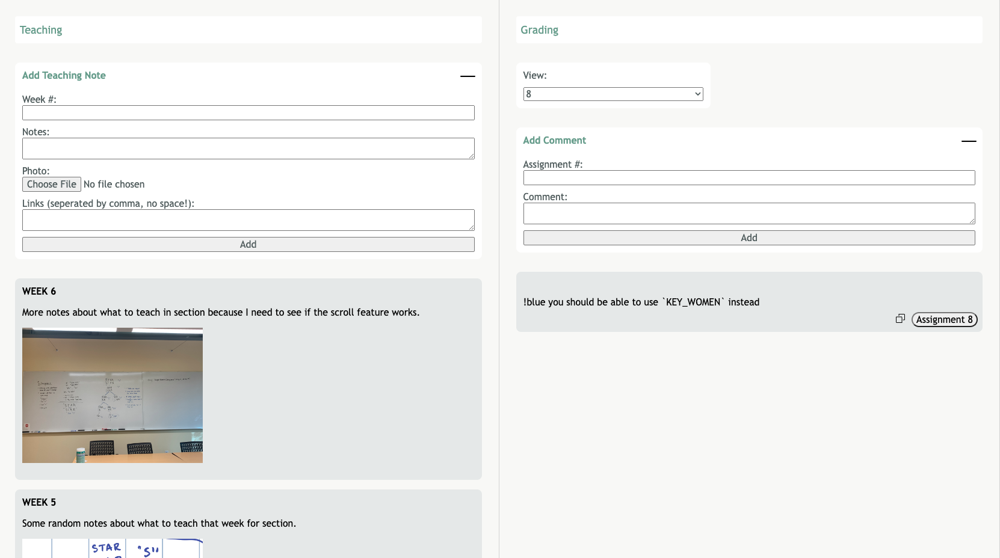

CS193X Final Project: SL Helper 
====================
NOTE: As of Jan 2023, I am currently working on deploying this correctly (this project is from close to a year ago!) It is deployed, but has issues with api fetches. 

Overview
--------
The SL Helper has a few tools that could help with CS106 section leading to keep everything organized in one place. The site is broken down into 3 parts: a teaching helper, an assignment grading helper, and a LAIR helper.

It is made entirely from scratch, with the frontend written in HTML and CSS and Javascript, and the backend written in Javascript, specifically Node and Express, and uses a MongoDB database.

Locally, the project looks like this:

It is semi-hosted here: https://cs198-slhelper.herokuapp.com/. Most functionality - adding cards, uploading images, loading past cards - is halted with api fetch errors. I hope to fix this in the coming months when I have the free time!

Running (locally for now)
-------
* download the "offline" branch
* follow steps to set up mongod: https://web.stanford.edu/class/cs193x/mongodb.html
* run 'npm install' and 'npm start'
* optional: there are two data files (output.js, output2.js) that you can pre-load using these instructions (https://docs.google.com/document/d/1Witc84ObQprENAymo5mXoyjfHXOEn5CDOB8uSSHKkaI/edit)
There is a ~300mb limit so please don't try to upload images too large of a size. I also have some pre mongodb stuff that should be there.

Features
--------
Teaching helper:
* form where users can create cards with a photo of their practice teaching whiteboard, links to handout/solutions for reference, notes
* cards can be deleted (hover over the card)

Grading helper:
* form where users can add comments
* copy the comment to clipboard by pressing the copy button
* can view comments for only for that week using the View dropdown

Special notes:
* all forms can be minimized with the small black bar! 

Misc notes:
-------------
I was planning on having an edit option (I was going to turn the text into text areas, transfer the information, and then use PATCH) but I ran out of time. I commented out the edit button on the HTML.

I also planned on having a LAIR (debugger) helper consisting of:
* form where users can upload a photo, notes, and code (using a code editor!)
* feature to view cards only for that class using the View dropdown
* button that displays a whiteboard

I had made the HTML/CSS of the LAIR helper, including a working code text editor that used CodeJar, but didn't have enough time to fully implement the JS so I took it out. I left the HTML/CSS and JS for the code text editor in my project if you guys want to see it, but I just commented it out.
